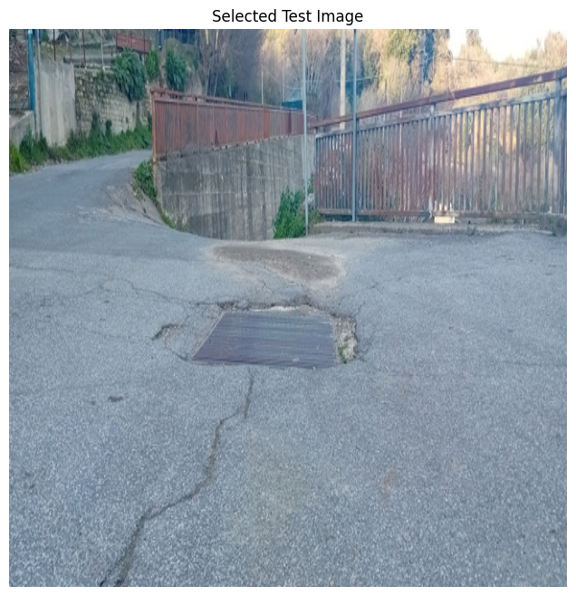
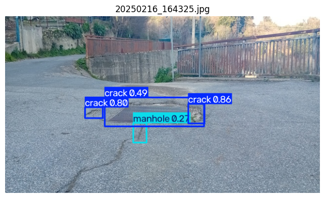
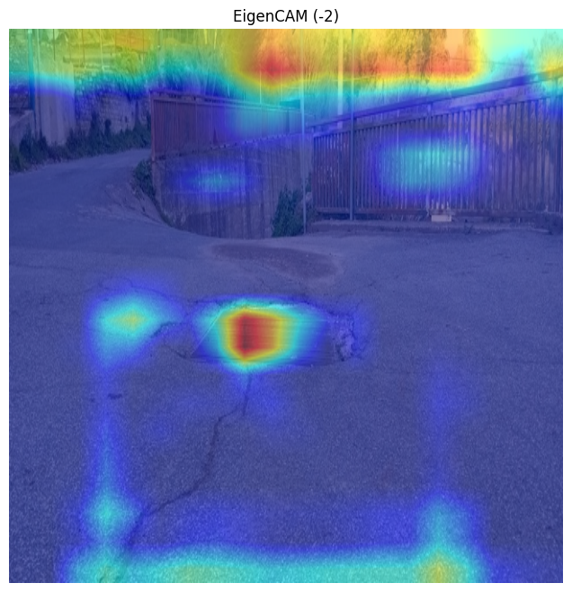

# Interpretable Road Damage Detection for Intelligent Transportation Systems using YOLOv8 Nano and EigenCAM

> A lightweight computer vision pipeline for automated road damage detection using **YOLOv8 Nano**, enhanced with **EigenCAM-based explainability** to improve the transparency and interpretability of object detection models.

---

## Project Overview

Road surface deterioration—including **potholes, cracks, and damaged pavement**—poses significant challenges for transportation safety, infrastructure maintenance, and intelligent transportation systems (ITS). Traditional road inspection methods rely heavily on manual surveys, making them time-consuming, expensive, and difficult to scale.

This project presents an **interpretable computer vision pipeline** for automated road damage detection using **YOLOv8 Nano**, a lightweight real-time object detector. In addition to object detection, the project integrates **EigenCAM**, a feature-based explainability technique that highlights the image regions contributing most strongly to the model's learned representations.

Unlike conventional object detection pipelines that only produce bounding-box predictions, this project demonstrates how explainability can complement deep learning models by providing qualitative insight into their decision-making process. The resulting workflow combines efficient road damage detection with transparent visual interpretation, making it suitable as a foundation for future research in **Explainable Artificial Intelligence (XAI)** and intelligent infrastructure monitoring.

---

## Technical Report

A detailed technical report accompanies this project and documents the complete development process, including the project motivation, methodology, experimental setup, model training, evaluation, EigenCAM explainability analysis, discussion, limitations, and future research directions.

- 📘 **Markdown Version:** `reports/technical_report.md`
- 📄 **PDF Version:** `reports/technical_report.pdf`
  
---

## Project Objectives

The primary objectives of this project are:

- Develop a lightweight road damage detector using **YOLOv8 Nano**.
- Detect three categories of road damage: **cracks, manholes, and potholes**.
- Evaluate the detector using standard object detection metrics.
- Improve model interpretability through **EigenCAM-based explainability**.
- Demonstrate how explainability techniques can complement object detection by providing qualitative insight into learned feature representations.
- Establish a reproducible foundation for future research in Explainable AI (XAI) for intelligent infrastructure monitoring.

---

## Repository Structure

```text
Interpretable-Road-Damage-Detection/
│
├── notebooks/
│   ├── 01_YOLOv8_Training.ipynb
│   └── 02_EigenCAM_Explainability_Analysis.ipynb
│
├── dataset/
│   └── data.yaml
│
├── models/
│   └── best.pt
│
├── figures/
│   ├── results.png
│   ├── confusion_matrix.png
│   ├── BoxPR_curve.png
│   ├── original_test_image.png
│   ├── yolo_detection.png
│   └── eigencam_selected_image.png
│
├── reports/
│   ├── technical_report.md
│   └── technical_report.pdf
│
├── README.md
└── .gitignore
```
---

## Dataset

The model was trained using the **Road Damage Dataset: Potholes, Cracks and Manholes**, which provides annotated road-surface images in YOLO object detection format.

### Classes

- Crack
- Manhole
- Pothole

### Dataset Statistics

| Split | Images |
|-------|-------:|
| Train | 1406 |
| Validation | 301 |
| Test | 302 |
| **Total** | **2009** |

The dataset was automatically downloaded using the Kaggle API and organized into training, validation, and testing splits before model training. 

---

## Baseline Experiment

Before training the custom road damage detector, the pretrained **YOLOv8 Nano** model (trained on the COCO dataset) was evaluated on a representative road image to assess its out-of-the-box performance.

### Original Image


### Prediction using Pretrained YOLOv8 Nano


### Observation

The pretrained YOLOv8 Nano model failed to detect the road pothole because the **COCO dataset does not contain road damage categories** such as potholes, pavement cracks, or manholes.

Instead, the model incorrectly classified part of the background vegetation as a **giraffe**, illustrating the limitations of applying a generic object detector to a specialized road inspection task.

This baseline experiment motivates the need for **domain-specific training**, where the detector is fine-tuned using annotated road damage images to accurately recognize infrastructure defects.

---

## Methodology

The overall workflow adopted in this project is illustrated below.

```text
Road Damage Dataset
        │
        ▼
Dataset Preparation
        │
        ▼
YOLOv8 Nano Training
        │
        ▼
Model Evaluation
        │
        ▼
Road Damage Detection
        │
        ▼
EigenCAM Explainability Analysis
        │
        ▼
Feature Layer Comparison
        │
        ▼
Qualitative Interpretation
```

The first stage focuses on training a lightweight object detector capable of identifying road damage categories from pavement images. After evaluating the trained model using standard object detection metrics, EigenCAM is applied to visualize the learned feature representations responsible for the detector's predictions.

Finally, multiple intermediate feature layers are compared to identify the layer producing the most informative activation maps, providing qualitative insight into the model's decision-making process.

---

## Model

This project employs **YOLOv8 Nano (YOLOv8n)** as the object detection backbone.

### Why YOLOv8 Nano?

YOLOv8 Nano was selected because it offers an effective balance between computational efficiency and detection performance. Its lightweight architecture makes it suitable for real-time inference and future deployment on resource-constrained edge devices while maintaining competitive object detection accuracy.

### Model Characteristics

- Lightweight architecture
- Fast inference speed
- Real-time object detection
- Suitable for edge deployment
- Easily integrated with explainability techniques such as EigenCAM

---

## Training Configuration

The YOLOv8 Nano model was fine-tuned on the custom road damage dataset using the following training configuration.

| Parameter | Value |
|-----------|------:|
| Model | YOLOv8 Nano |
| Epochs | 30 |
| Image Size | 640 × 640 |
| Batch Size | 16 |
| Optimizer | Auto |
| Device | NVIDIA Tesla T4 GPU |

---

## Model Performance

The trained YOLOv8 Nano model was evaluated on the validation set using standard object detection metrics.

### Overall Validation Performance

| Metric | Value |
|---------|------:|
| Precision | **0.497** |
| Recall | **0.475** |
| mAP@0.50 | **0.442** |
| mAP@0.50:0.95 | **0.193** |

### Per-Class Performance

| Class | mAP@0.50 |
|--------|---------:|
| Crack | 0.360 |
| Manhole | 0.309 |
| Pothole | **0.658** |

Among the three road damage categories, **potholes achieved the highest detection performance**, indicating that they possess more distinctive visual characteristics than cracks or manholes. Crack detection remained the most challenging task because of their thin structures, varying orientations, and lower visual contrast with surrounding pavement.

---

## Training Results

The figures below summarize the learning behaviour of the trained YOLOv8 Nano detector.

### Training Metrics


### Precision–Recall Curve


### Confusion Matrix


---

## Results and Discussion

The custom-trained YOLOv8 Nano model successfully learned to detect three categories of road damage: **cracks, manholes, and potholes**.

Evaluation results demonstrate that the detector performs best on potholes, while crack and manhole detection remain more challenging because of their visual variability, smaller object size, and similarity to surrounding pavement textures.

The confusion matrix further indicates that several crack and manhole instances were either missed or confused with background regions, suggesting opportunities for improvement through larger datasets, additional augmentation strategies, or higher-capacity YOLO architectures.

Despite these limitations, the project demonstrates that lightweight object detection models can provide an effective foundation for automated road inspection while remaining computationally efficient for future edge deployment.

---

## Qualitative Results

To complement the quantitative evaluation, the trained YOLOv8 Nano model was qualitatively analyzed using a representative test image from the road damage dataset.

### Original Test Image



---

### YOLOv8 Nano Detection

The trained detector successfully localizes the pothole using a bounding box and confidence score.



---

### EigenCAM Explainability

EigenCAM provides a feature-based visualization of the regions that contribute most strongly to the detector's learned representations.



---

## Explainability Analysis

Unlike conventional object detectors that only output bounding boxes, EigenCAM provides qualitative insight into the internal feature representations learned by the network.

Multiple intermediate feature layers (**−2**, **−3**, **−4**, and **−5**) were evaluated to identify the most informative activation maps.

Among the evaluated layers, **Layer −2** produced the clearest localization around the road surface while suppressing unrelated background regions. Deeper feature layers generated increasingly sparse activations and occasionally emphasized surrounding structures rather than the damaged pavement itself.

These observations suggest that intermediate feature representations provide a better balance between semantic information and spatial localization for interpreting YOLOv8 Nano predictions.

---

## Limitations

Although the proposed pipeline demonstrates promising performance, several limitations remain:

- The model was trained for only **30 epochs**, leaving room for further optimization.
- YOLOv8 Nano prioritizes computational efficiency over maximum detection accuracy.
- Crack detection remains challenging because of thin structures and low visual contrast.
- The dataset contains a limited number of training samples for certain damage categories.
- The explainability analysis is qualitative and based on EigenCAM feature visualizations rather than quantitative XAI evaluation metrics.

---

## Future Work

Several directions can further improve this project:

- Train larger YOLOv8 variants (YOLOv8s, YOLOv8m, YOLOv8l).
- Perform hyperparameter optimization.
- Increase dataset diversity through additional road damage datasets.
- Apply advanced augmentation techniques to improve crack detection.
- Compare EigenCAM with other explainability methods such as Grad-CAM, Grad-CAM++, LayerCAM, and Score-CAM.
- Evaluate explainability using quantitative XAI metrics.
- Extend the system to real-time video-based road inspection.
- Deploy the trained detector on edge devices for intelligent transportation applications.
---

## Technologies Used

- Python
- PyTorch
- Ultralytics YOLOv8
- OpenCV
- NumPy
- Matplotlib
- Google Colab
- EigenCAM
- Kaggle API

---

## Applications

Potential applications of this work include:

- Intelligent Transportation Systems (ITS)
- Smart City Infrastructure Monitoring
- Automated Road Inspection
- Pavement Condition Assessment
- AI-assisted Maintenance Planning
- Edge AI for Infrastructure Monitoring

---

## Author

**Riya Soy**

Mechatronics Engineer

### Research Interests

- Computer Vision
- Explainable Artificial Intelligence (XAI)
- Intelligent Infrastructure Systems
- Edge AI
- AI Governance

---

## Acknowledgements

This project was developed using the following open-source tools and resources:

- Ultralytics YOLOv8
- PyTorch
- OpenCV
- EigenCAM (YOLO-V8-CAM)
- Kaggle Road Damage Dataset
