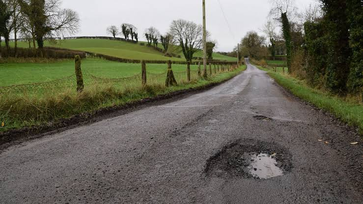
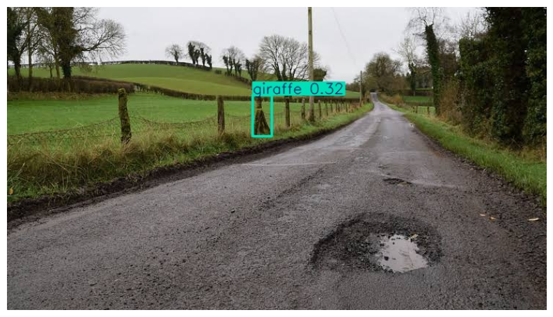
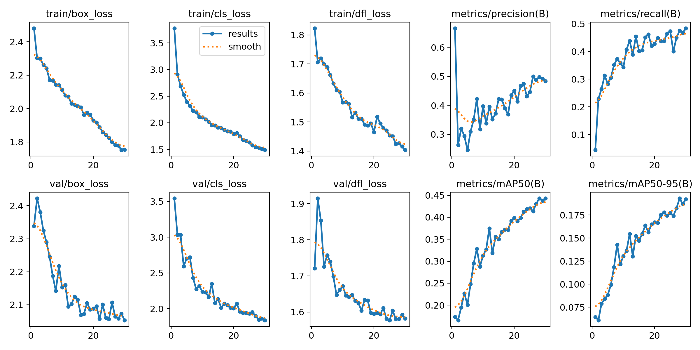
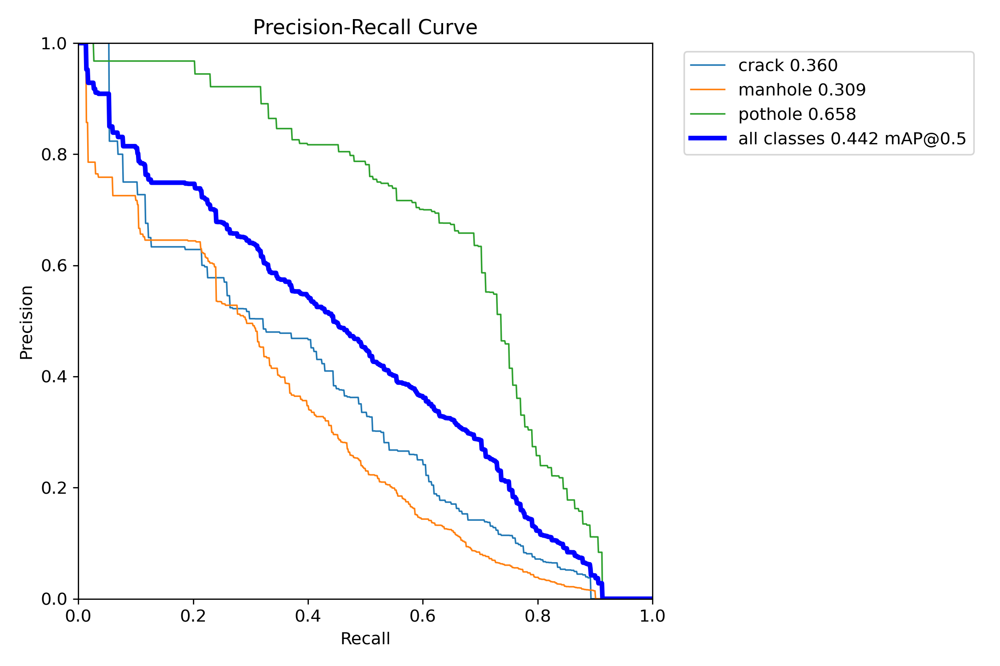
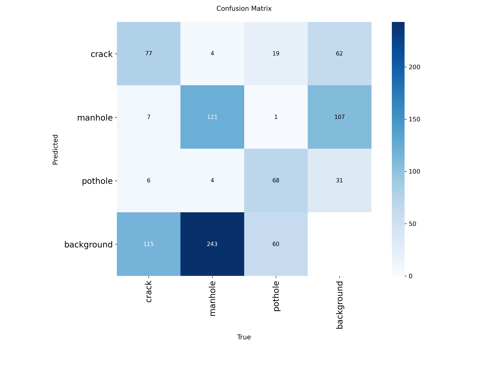

# Explainable Road Damage Detection using YOLOv8 and Grad-CAM

> A Computer Vision project for automated road damage detection using YOLOv8 Nano, with planned Grad-CAM integration for Explainable AI.

---

# Project Overview

Road damage detection plays an important role in intelligent transportation systems, autonomous driving, and smart city infrastructure. Manual road inspection is expensive, time-consuming, and often inconsistent.

This project develops a lightweight deep learning pipeline capable of detecting multiple categories of road damage using YOLOv8 Nano while laying the foundation for future integration of Explainable Artificial Intelligence (XAI) through Grad-CAM.

Unlike traditional object detection projects that only produce bounding boxes, this project is designed to be extended with Grad-CAM so that future versions can visualize why the neural network predicts a particular road defect.

---

# 📄 Technical Report

A detailed technical report describing the project motivation, methodology, experimental setup, evaluation, discussion, limitations, and future work is available below.

- 📘 **Markdown Report:** [technical_report.md](reports/technical_report.md)
- 📄 **PDF Report:** [technical_report.pdf](reports/technical_report.pdf)

---

# Objectives

- Detect road damage automatically using YOLOv8.
- Train a custom object detector on a road damage dataset.
- Evaluate performance using standard object detection metrics.
- Integrate Grad-CAM for future interpretation of model predictions.
- Demonstrate how Explainable AI improves transparency and trust in computer vision.

---

# Project Structure

```text
Explainable-Road-Damage-Detection/
│
├── data/                 # Dataset configuration
├── figures/              # Training curves and evaluation plots
├── images/               # Sample images
├── models/               # Trained YOLOv8 weights
├── notebooks/            # Google Colab notebook
├── outputs/              # Prediction outputs
├── reports/              # Project documentation
├── scripts/              # Helper scripts
├── README.md
└── .gitignore
```

---

# Dataset

**Road Damage Dataset: Potholes, Cracks and Manholes**

### Classes

- Crack
- Manhole
- Pothole

### Dataset Statistics

| Split | Images |
|-------|-------:|
| Train | 1406 |
| Validation | 301 |
| Test | 302 |
| **Total** | **2009** |

---

# Baseline Experiment

Before training the custom detector, the pretrained **YOLOv8 Nano** model was evaluated on a road image.

### Input Image



### Prediction



### Observation

The pretrained COCO model failed to detect the pothole because road damage classes are not included in the COCO dataset.

Instead, it incorrectly classified a background tree as a giraffe.

This experiment demonstrates why domain-specific training is required.

---

# Model

**YOLOv8 Nano (yolov8n)**

### Why YOLOv8 Nano?

- Lightweight architecture
- Fast inference
- Suitable for edge devices
- Excellent baseline model
- Easy integration with Explainable AI

---

# Methodology

```text
Road Damage Dataset
        │
        ▼
Dataset Preparation
        │
        ▼
Train / Validation / Test Split
        │
        ▼
YOLOv8 Training
        │
        ▼
Performance Evaluation
        │
        ▼
Road Damage Detection
        │
        ▼
Grad-CAM Visualization
        │
        ▼
Model Interpretation
```

---

# Training Configuration

| Parameter | Value |
|-----------|------:|
| Model | YOLOv8 Nano |
| Epochs | 30 |
| Image Size | 640 × 640 |
| Batch Size | 16 |
| Optimizer | Auto |
| Device | Tesla T4 GPU |

---

# Model Performance

### Overall Validation Performance

| Metric | Value |
|---------|------:|
| Precision | **0.497** |
| Recall | **0.475** |
| mAP@0.50 | **0.442** |
| mAP@0.50:0.95 | **0.193** |

### Per-Class Performance

| Class | mAP@0.50 |
|--------|---------:|
| Crack | 0.360 |
| Manhole | 0.309 |
| Pothole | 0.658 |

The model achieved its strongest performance on pothole detection, while crack and manhole detection remain more challenging because of visual variability and limited training samples.

---

# Training Results

### Training Metrics



### Precision–Recall Curve



### Confusion Matrix



---

# Results and Discussion

The custom-trained YOLOv8 Nano model successfully learned to detect three categories of road damage: cracks, manholes, and potholes.

Among the three classes, potholes achieved the highest detection accuracy because they exhibit more distinctive visual features.

The confusion matrix indicates that several crack and manhole instances were missed, suggesting opportunities for improvement through additional data, stronger augmentation, or larger YOLO variants.

Overall, the project demonstrates that lightweight object detection models can provide an effective foundation for automated road inspection systems.

---

# Explainable AI using Grad-CAM

Traditional object detectors only provide predictions.

Grad-CAM highlights the image regions that most influenced the model's prediction, making deep learning decisions more interpretable.

### Benefits

- Improves model transparency
- Helps explain predictions
- Assists in debugging false detections
- Increases trust in AI systems
- Supports responsible AI development

> **Status:** Grad-CAM implementation is currently under development and will be integrated into the inference pipeline in a future update.

---

# Limitations

- Model trained for only **30 epochs**
- YOLOv8 Nano prioritizes speed over maximum accuracy
- Limited dataset size
- Small cracks remain difficult to detect
- Grad-CAM integration is still in progress

---

# Future Work

- Complete Grad-CAM integration
- Train larger YOLOv8 variants (YOLOv8s/YOLOv8m)
- Hyperparameter optimization
- Advanced data augmentation
- Evaluate additional road damage datasets
- Real-time video inference
- Edge deployment
- Compare with Faster R-CNN and newer YOLO models

---

# Technologies Used

- Python
- PyTorch
- Ultralytics YOLOv8
- OpenCV
- NumPy
- Matplotlib
- Google Colab
- Grad-CAM

---

# Applications

- Smart Cities
- Intelligent Transportation Systems
- Autonomous Vehicles
- Infrastructure Monitoring
- Automated Road Inspection
- AI-assisted Maintenance Systems

---

# Author

**Riya Soy**

Mechatronics Engineer

**Research Interests**

- Computer Vision
- Explainable AI
- Intelligent Infrastructure
- Edge AI
- AI Governance

---

# Acknowledgements

- Ultralytics YOLOv8
- PyTorch
- OpenCV
- Road Damage Dataset authors
